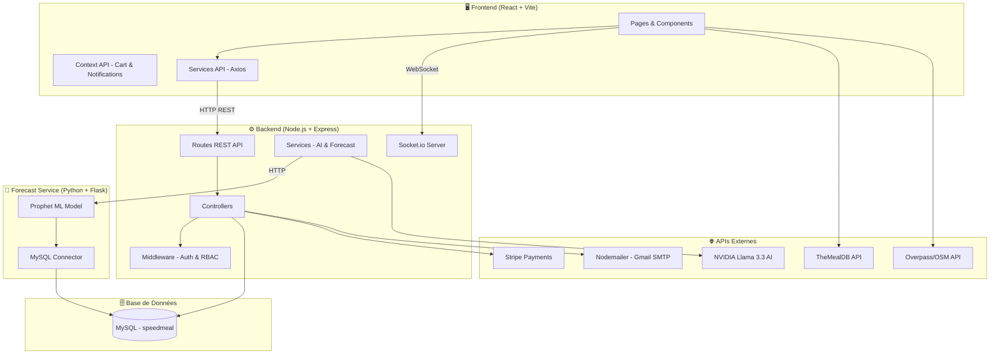
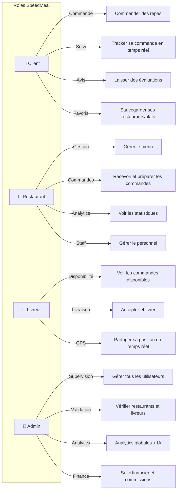
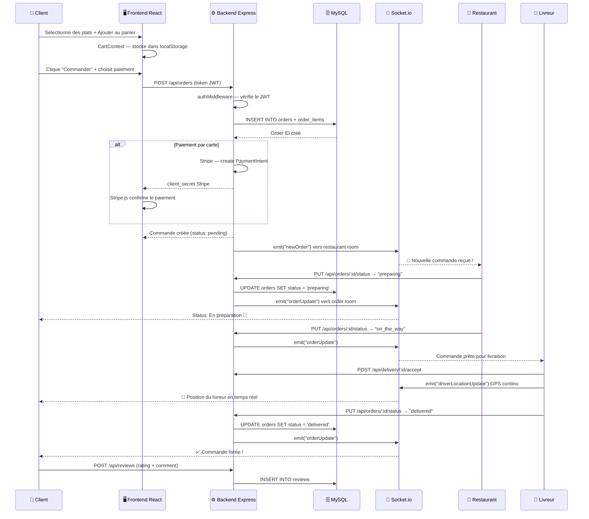
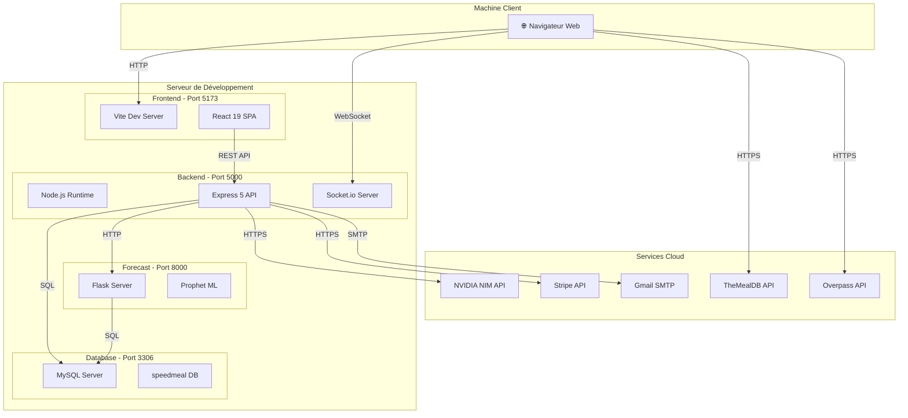
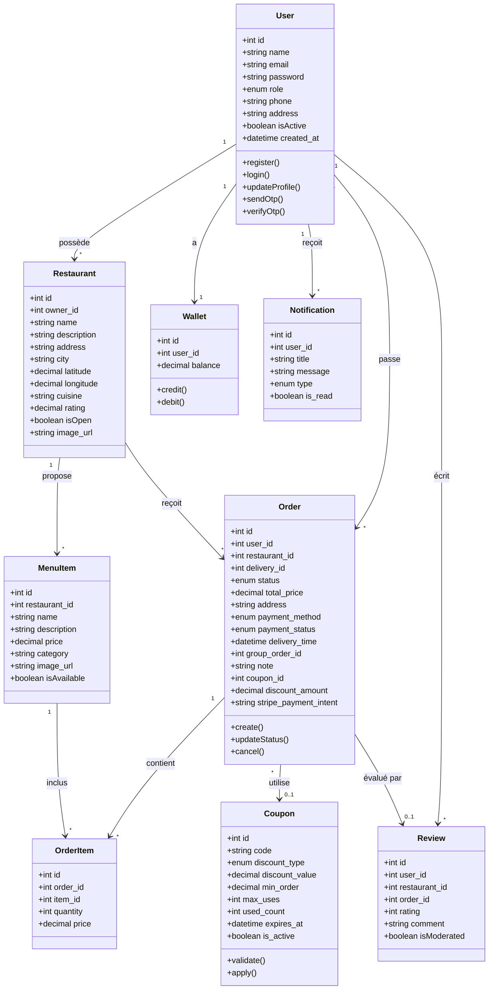
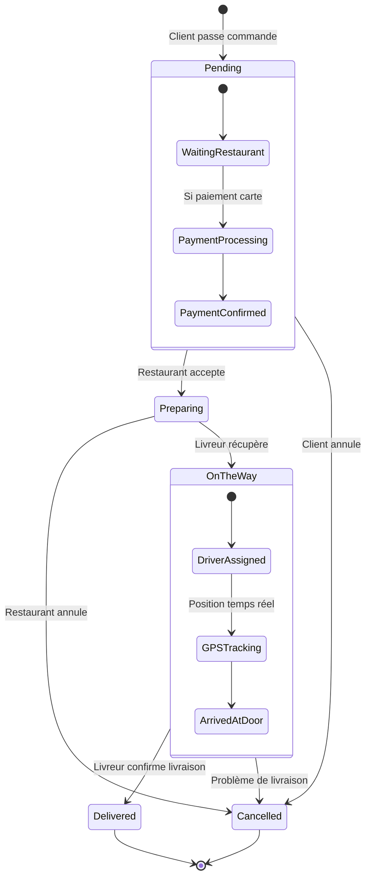
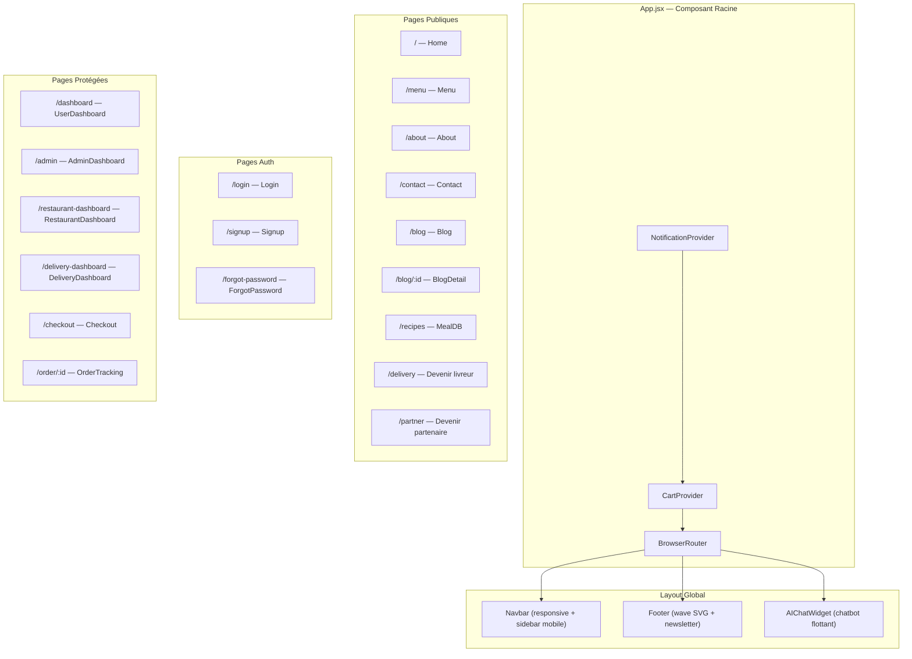
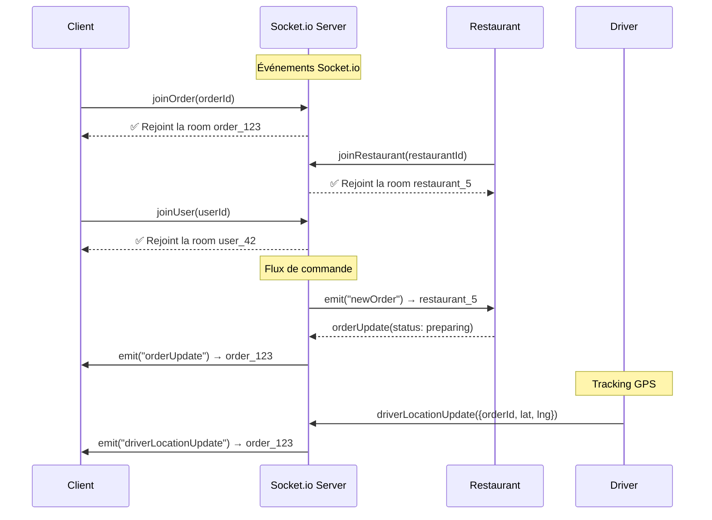

# 📋 SpeedMeal — Documentation Complète du Projet

> **SpeedMeal** est une plateforme de livraison de repas en ligne développée pour le marché marocain.  
> Elle connecte les **clients**, **restaurants**, **livreurs** et un **administrateur** dans un écosystème complet.

---

## 📑 Table des Matières

1. [Architecture Générale](#1-architecture-générale)
2. [Stack Technologique & Bibliothèques](#2-stack-technologique--bibliothèques)
3. [Structure du Projet](#3-structure-du-projet)
4. [Base de Données (MySQL)](#4-base-de-données-mysql)
5. [API Backend — Routes & Endpoints](#5-api-backend--routes--endpoints)
6. [Fonctionnalités Détaillées](#6-fonctionnalités-détaillées)
7. [Diagrammes UML / Mermaid](#7-diagrammes-uml--mermaid)
8. [Sécurité](#8-sécurité)
9. [APIs Externes Intégrées](#9-apis-externes-intégrées)
10. [Communication Temps Réel (WebSocket)](#10-communication-temps-réel-websocket)

---

## 1. Architecture Générale

SpeedMeal suit une **architecture 3-tiers** (Three-Tier Architecture) :



| Couche | Technologie | Port |
|--------|------------|------|
| **Frontend** | React 19 + Vite 8 | `5173` |
| **Backend API** | Node.js + Express 5 | `5000` |
| **Forecast Service** | Python + Flask 3 | `8000` |
| **Base de données** | MySQL (speedmeal) | `3306` |

---

## 2. Stack Technologique & Bibliothèques

### 🟢 Frontend (React)

| Bibliothèque | Version | Rôle |
|--------------|---------|------|
| **React** | 19.2.5 | Framework UI principal |
| **React DOM** | 19.2.5 | Rendu DOM |
| **React Router DOM** | 7.15.0 | Routage SPA (18 routes) |
| **Vite** | 8.0.10 | Bundler & serveur de développement |
| **Framer Motion** | 12.38.0 | Animations et transitions fluides |
| **Axios** | 1.16.0 | Client HTTP pour les appels API |
| **Chart.js** | 4.5.1 | Graphiques et visualisation de données |
| **React-Chartjs-2** | 5.3.1 | Wrapper React pour Chart.js |
| **Leaflet** | 1.9.4 | Cartes interactives (maps) |
| **React-Leaflet** | 5.0.0 | Wrapper React pour Leaflet |
| **Lucide React** | 1.14.0 | Icônes SVG modernes |
| **Socket.io Client** | 4.8.3 | Communication WebSocket temps réel |
| **jsPDF** | 4.2.1 | Génération de fichiers PDF |
| **jsPDF-AutoTable** | 5.0.8 | Tableaux automatiques dans les PDF |
| **XLSX** | 0.18.5 | Export de données en fichiers Excel |

### 🔵 Backend (Node.js)

| Bibliothèque | Version | Rôle |
|--------------|---------|------|
| **Express** | 5.2.1 | Framework web HTTP |
| **MySQL2** | 3.22.3 | Driver MySQL avec support Promises |
| **Socket.io** | 4.8.3 | Serveur WebSocket temps réel |
| **JSON Web Token (JWT)** | 9.0.3 | Authentification par tokens |
| **BcryptJS** | 3.0.3 | Hashage sécurisé des mots de passe |
| **CORS** | 2.8.6 | Gestion des origines croisées |
| **Helmet** | 8.1.0 | Sécurité des headers HTTP |
| **Morgan** | 1.10.1 | Logger des requêtes HTTP |
| **Dotenv** | 17.4.2 | Variables d'environnement (.env) |
| **Nodemailer** | 8.0.10 | Envoi d'emails (OTP, notifications) |
| **Stripe** | 22.2.0 | Paiement en ligne par carte bancaire |
| **OpenAI SDK** | 6.42.0 | Client pour l'API NVIDIA Llama |
| **Axios** | 1.17.0 | Appels HTTP vers le forecast service |
| **iconv-lite** | 0.6.3 | Encodage de caractères |

### 🟡 Forecast Service (Python)

| Bibliothèque | Version | Rôle |
|--------------|---------|------|
| **Flask** | 3.0.3 | Micro-framework web Python |
| **Flask-CORS** | 4.0.1 | Gestion CORS pour Flask |
| **Prophet** | 1.1.5 | Modèle ML de prédiction de séries temporelles (Facebook) |
| **Pandas** | 2.2.2 | Manipulation et analyse de données |
| **mysql-connector-python** | 8.4.0 | Connexion directe à MySQL |

---

## 3. Structure du Projet

```
SpeedMeal/
├── 📁 frontend/                    # Application React (Vite)
│   ├── 📁 src/
│   │   ├── 📁 pages/              # 19 pages principales
│   │   │   ├── Home.jsx           # Page d'accueil
│   │   │   ├── Menu.jsx           # Menu des restaurants
│   │   │   ├── Login.jsx          # Connexion
│   │   │   ├── Signup.jsx         # Inscription
│   │   │   ├── ForgotPassword.jsx # Réinitialisation mot de passe (OTP)
│   │   │   ├── About.jsx          # Page À propos
│   │   │   ├── Contact.jsx        # Page Contact
│   │   │   ├── Blog.jsx           # Liste des articles
│   │   │   ├── BlogDetail.jsx     # Détail d'un article
│   │   │   ├── Checkout.jsx       # Panier & paiement
│   │   │   ├── OrderTracking.jsx  # Suivi de commande en temps réel
│   │   │   ├── Delivery.jsx       # Page "Devenir livreur"
│   │   │   ├── Partner.jsx        # Page "Devenir partenaire"
│   │   │   ├── MealDB.jsx         # Explorateur de recettes (TheMealDB)
│   │   │   ├── NearbyRestaurants.jsx  # Restaurants à proximité (carte)
│   │   │   ├── UserDashboard.jsx      # Dashboard client
│   │   │   ├── AdminDashboard.jsx     # Dashboard administrateur
│   │   │   ├── RestaurantDashboard.jsx # Dashboard restaurant
│   │   │   └── DeliveryDashboard.jsx  # Dashboard livreur
│   │   ├── 📁 components/         # 11 composants réutilisables
│   │   │   ├── AIChatWidget.jsx       # Widget chatbot IA
│   │   │   ├── CategoriesSection.jsx  # Section catégories
│   │   │   ├── ClientReviewsSection.jsx # Avis clients
│   │   │   ├── FAQSection.jsx         # FAQ accordion
│   │   │   ├── FeaturesSection.jsx    # Fonctionnalités
│   │   │   ├── Illustrations.jsx      # SVG illustrations
│   │   │   ├── LoadingScreen.jsx      # Écran de chargement animé
│   │   │   ├── PartnerSection.jsx     # Section partenaires
│   │   │   ├── RestaurantCard.jsx     # Carte restaurant
│   │   │   ├── RestaurantsSection.jsx # Liste restaurants
│   │   │   └── SectionTitle.jsx       # Titre de section
│   │   ├── 📁 context/            # État global React
│   │   │   ├── CartContext.jsx        # Panier (ajout, suppression, total)
│   │   │   └── NotificationContext.jsx # Notifications toast
│   │   ├── 📁 services/           # Services API externes
│   │   │   ├── mealDBAPI.js           # TheMealDB (recettes)
│   │   │   ├── openMenuAPI.js         # OpenMenu proxy
│   │   │   └── overpassAPI.js         # Overpass/OSM (restaurants réels)
│   │   ├── App.jsx                # Composant racine + Navbar + Footer + Routes
│   │   ├── main.jsx               # Point d'entrée React
│   │   ├── App.css                # Styles globaux
│   │   └── index.css              # Styles de base
│   ├── index.html
│   ├── vite.config.js
│   └── package.json
│
├── 📁 backend/                     # API Node.js (Express)
│   ├── 📁 src/
│   │   ├── 📁 config/
│   │   │   └── db.js              # Pool de connexions MySQL
│   │   ├── 📁 middleware/
│   │   │   └── auth.js            # JWT auth + RBAC (Role-Based Access)
│   │   ├── 📁 controllers/        # 8 contrôleurs
│   │   │   ├── authController.js      # Register, Login, OTP, Profile
│   │   │   ├── orderController.js     # CRUD commandes
│   │   │   ├── restaurantController.js # CRUD restaurants
│   │   │   ├── financialController.js # Gestion financière
│   │   │   ├── analyticsController.js # Analytics & stats
│   │   │   ├── promotionsController.js # Promotions & offres
│   │   │   ├── staffController.js     # Gestion du personnel
│   │   │   └── settingsController.js  # Paramètres
│   │   ├── 📁 routes/             # 21 fichiers de routes
│   │   │   ├── authRoutes.js
│   │   │   ├── restaurantRoutes.js
│   │   │   ├── orderRoutes.js
│   │   │   ├── adminRoutes.js
│   │   │   ├── deliveryRoutes.js
│   │   │   ├── reviewRoutes.js
│   │   │   ├── groupOrderRoutes.js
│   │   │   ├── couponRoutes.js
│   │   │   ├── favoriteRoutes.js
│   │   │   ├── notificationRoutes.js
│   │   │   ├── addressRoutes.js
│   │   │   ├── restaurantDashboardRoutes.js
│   │   │   ├── openMenuProxy.js
│   │   │   ├── aiRoutes.js
│   │   │   ├── financialRoutes.js
│   │   │   ├── staffRoutes.js
│   │   │   ├── analyticsRoutes.js
│   │   │   ├── promotionsRoutes.js
│   │   │   ├── settingsRoutes.js
│   │   │   ├── publicStatsRoutes.js
│   │   │   └── complaintRoutes.js
│   │   ├── 📁 services/           # Services internes
│   │   │   ├── nvidiaService.js       # IA NVIDIA Llama 3.3
│   │   │   └── forecastService.js     # Connecteur vers Python
│   │   ├── index.js               # Point d'entrée serveur
│   │   ├── init_db.js             # Initialisation DB
│   │   ├── seed_db.js             # Données de test
│   │   └── migrate_*.js           # 12 fichiers de migration
│   ├── .env                       # Variables d'environnement
│   └── package.json
│
├── 📁 forecast-service/           # Service de prédiction (Python)
│   ├── app.py                     # Serveur Flask + Prophet
│   └── requirements.txt
│
└── database.sql                   # Schéma complet de la BDD
```

---

## 4. Base de Données (MySQL)

### Diagramme Entité-Relation (ERD)

```mermaid
erDiagram
    users ||--o{ orders : "passe"
    users ||--o{ restaurants : "possède"
    users ||--o{ reviews : "écrit"
    users ||--o{ user_addresses : "a"
    users ||--o{ favorites : "ajoute"
    users ||--o{ notifications : "reçoit"
    users ||--o{ wallets : "possède"
    users ||--o{ loyalty_points : "accumule"
    users ||--o{ delivery_locations : "envoie"

    restaurants ||--o{ menu_items : "propose"
    restaurants ||--o{ orders : "reçoit"
    restaurants ||--o{ reviews : "a"
    restaurants ||--o{ restaurant_hours : "définit"
    restaurants ||--o{ restaurant_earnings : "génère"
    restaurants ||--o{ restaurant_staff : "emploie"

    orders ||--o{ order_items : "contient"
    orders }o--|| coupons : "utilise"
    orders ||--o{ delivery_locations : "suivi par"
    orders ||--o{ coupon_usages : "enregistre"

    menu_items ||--o{ order_items : "inclus dans"
    menu_items ||--o{ favorites : "favori"

    group_orders ||--o{ orders : "regroupe"

    wallets ||--o{ wallet_transactions : "historique"

    coupons ||--o{ coupon_usages : "utilisé par"

    users {
        INT id PK
        VARCHAR name
        VARCHAR email UK
        VARCHAR password
        ENUM role "client/restaurant/delivery/admin"
        VARCHAR phone
        TEXT address
        BOOLEAN isActive
        TIMESTAMP created_at
    }

    restaurants {
        INT id PK
        INT owner_id FK
        VARCHAR name
        TEXT description
        VARCHAR address
        VARCHAR city
        DECIMAL latitude
        DECIMAL longitude
        VARCHAR cuisine
        DECIMAL rating
        BOOLEAN isOpen
        VARCHAR image_url
    }

    menu_items {
        INT id PK
        INT restaurant_id FK
        VARCHAR name
        TEXT description
        DECIMAL price
        VARCHAR category
        VARCHAR image_url
        BOOLEAN isAvailable
    }

    orders {
        INT id PK
        INT user_id FK
        INT restaurant_id FK
        INT delivery_id FK
        ENUM status "pending/preparing/on_the_way/delivered/cancelled"
        DECIMAL total_price
        TEXT address
        ENUM payment_method "card/cash"
        ENUM payment_status "paid/pending"
        DATETIME delivery_time
        INT group_order_id FK
        TEXT note
        INT coupon_id FK
        DECIMAL discount_amount
        VARCHAR stripe_payment_intent
    }

    order_items {
        INT id PK
        INT order_id FK
        INT item_id FK
        INT quantity
        DECIMAL price
    }

    reviews {
        INT id PK
        INT user_id FK
        INT restaurant_id FK
        INT order_id FK
        INT rating "1-5"
        TEXT comment
        BOOLEAN isModerated
    }

    coupons {
        INT id PK
        VARCHAR code UK
        ENUM discount_type "percentage/fixed"
        DECIMAL discount_value
        DECIMAL min_order
        INT max_uses
        INT used_count
        DATETIME expires_at
        BOOLEAN is_active
    }

    wallets {
        INT id PK
        INT user_id FK_UK
        DECIMAL balance
    }

    loyalty_points {
        INT id PK
        INT user_id FK_UK
        INT points
        INT total_earned
    }

    notifications {
        INT id PK
        INT user_id FK
        VARCHAR title
        TEXT message
        ENUM type "order/promo/system/delivery"
        BOOLEAN is_read
    }
```

### Liste Complète des Tables (20 tables)

| # | Table | Description | Clés Étrangères |
|---|-------|-------------|-----------------|
| 1 | `users` | Tous les utilisateurs (client, restaurant, delivery, admin) | — |
| 2 | `restaurants` | Informations des restaurants | `owner_id → users.id` |
| 3 | `menu_items` | Plats et articles du menu | `restaurant_id → restaurants.id` |
| 4 | `orders` | Commandes passées | `user_id`, `restaurant_id`, `delivery_id`, `coupon_id` |
| 5 | `order_items` | Détail des articles par commande | `order_id → orders.id`, `item_id → menu_items.id` |
| 6 | `group_orders` | Commandes groupées (code partagé) | `creator_id → users.id` |
| 7 | `reviews` | Avis et évaluations (1-5 étoiles) | `user_id`, `restaurant_id`, `order_id` |
| 8 | `delivery_locations` | Positions GPS des livreurs en temps réel | `delivery_id`, `order_id` |
| 9 | `user_addresses` | Adresses multiples par utilisateur | `user_id → users.id` |
| 10 | `coupons` | Codes promo (percentage ou fixed) | — |
| 11 | `coupon_usages` | Historique d'utilisation des coupons | `coupon_id`, `user_id`, `order_id` |
| 12 | `favorites` | Restaurants et plats favoris | `user_id`, `restaurant_id`, `item_id` |
| 13 | `notifications` | Notifications in-app | `user_id → users.id` |
| 14 | `restaurant_hours` | Horaires d'ouverture par jour | `restaurant_id → restaurants.id` |
| 15 | `delivery_zones` | Zones de livraison avec tarifs | — |
| 16 | `wallets` | Portefeuille numérique utilisateur | `user_id → users.id` |
| 17 | `wallet_transactions` | Historique des transactions wallet | `wallet_id → wallets.id` |
| 18 | `loyalty_points` | Points de fidélité | `user_id → users.id` |
| 19 | `restaurant_earnings` | Revenus et commissions des restaurants | `restaurant_id → restaurants.id` |
| 20 | `restaurant_staff` | Personnel des restaurants (manager, cashier, kitchen) | `restaurant_id`, `user_id` |

---

## 5. API Backend — Routes & Endpoints

### Architecture des Routes

| Préfixe | Fichier | Description |
|---------|---------|-------------|
| `/api/auth` | `authRoutes.js` | Authentification (register, login, OTP) |
| `/api/restaurants` | `restaurantRoutes.js` | CRUD restaurants |
| `/api/orders` | `orderRoutes.js` | Gestion des commandes |
| `/api/admin` | `adminRoutes.js` | Panneau d'administration |
| `/api/delivery` | `deliveryRoutes.js` | Gestion des livreurs |
| `/api/reviews` | `reviewRoutes.js` | Avis et évaluations |
| `/api/group-orders` | `groupOrderRoutes.js` | Commandes groupées |
| `/api/coupons` | `couponRoutes.js` | Codes promo |
| `/api/favorites` | `favoriteRoutes.js` | Favoris (restaurants & plats) |
| `/api/notifications` | `notificationRoutes.js` | Notifications |
| `/api/addresses` | `addressRoutes.js` | Adresses multiples |
| `/api/restaurant-dashboard` | `restaurantDashboardRoutes.js` | Dashboard restaurant |
| `/api/openmenu` | `openMenuProxy.js` | Proxy OpenMenu API |
| `/api/ai` | `aiRoutes.js` | Intelligence artificielle |
| `/api/financial` | `financialRoutes.js` | Gestion financière |
| `/api/staff` | `staffRoutes.js` | Gestion du personnel |
| `/api/analytics` | `analyticsRoutes.js` | Analytics et statistiques |
| `/api/promotions` | `promotionsRoutes.js` | Promotions et offres |
| `/api/settings` | `settingsRoutes.js` | Paramètres |
| `/api/public-stats` | `publicStatsRoutes.js` | Statistiques publiques |
| `/api/complaints` | `complaintRoutes.js` | Réclamations |
| `/api/health` | *inline* | Health check |

### Endpoints Principaux par Module

#### 🔐 Authentification (`/api/auth`)
- `POST /register` — Inscription (client, restaurant, delivery)
- `POST /login` — Connexion (retourne JWT)
- `GET /me` — Profil de l'utilisateur connecté
- `PUT /me` — Mise à jour du profil
- `POST /send-otp` — Envoi OTP par email
- `POST /verify-otp` — Vérification OTP + reset password

#### 🍽️ Restaurants (`/api/restaurants`)
- `GET /` — Liste de tous les restaurants
- `GET /:id` — Détail d'un restaurant
- `GET /:id/menu` — Menu d'un restaurant

#### 📦 Commandes (`/api/orders`)
- `POST /` — Créer une commande
- `GET /my` — Mes commandes (client)
- `GET /:id` — Détail d'une commande
- `PUT /:id/status` — Mettre à jour le statut

#### 🛡️ Admin (`/api/admin`)
- `GET /stats` — Statistiques globales
- `GET /users` — Liste des utilisateurs
- `PUT /users/:id/toggle` — Activer/désactiver un utilisateur
- `GET /restaurants` — Tous les restaurants
- `PUT /restaurants/:id/verify` — Vérifier un restaurant
- `GET /orders` — Toutes les commandes

#### 🚴 Livraison (`/api/delivery`)
- `GET /available` — Commandes disponibles pour livraison
- `POST /:id/accept` — Accepter une commande
- `PUT /:id/location` — Mettre à jour la position GPS
- `GET /my-deliveries` — Mes livraisons

#### 🤖 Intelligence Artificielle (`/api/ai`)
- `POST /chat` — Chat avec l'assistant IA NVIDIA Llama
- `GET /forecast` — Prédiction des commandes (Prophet)
- `GET /forecast/interpret` — Interprétation IA des prédictions

---

## 6. Fonctionnalités Détaillées

### 👤 Rôles Utilisateurs



### 🛒 Fonctionnalités Client
- **Parcourir les restaurants** : Liste complète, filtrage par cuisine/ville, recherche
- **Voir les menus** : Catégories, prix, disponibilité, images
- **Panier intelligent** : Multi-articles, gestion par restaurant unique, persistance localStorage
- **Commande** : Cash ou Carte bancaire (Stripe), notes, adresse de livraison
- **Coupons de réduction** : Pourcentage ou montant fixe, validation automatique
- **Suivi de commande en temps réel** : WebSocket, carte GPS du livreur
- **Avis et évaluations** : Notes 1-5 étoiles + commentaire
- **Favoris** : Sauvegarder restaurants et plats
- **Adresses multiples** : Plusieurs adresses de livraison par utilisateur
- **Notifications** : Alertes en temps réel sur le statut de commande
- **Dashboard personnel** : Historique, statistiques, profil
- **Explorateur de recettes** : Intégration TheMealDB (recherche, catégories, détails)
- **Restaurants à proximité** : Carte interactive Leaflet + données OpenStreetMap
- **Commandes groupées** : Code partagé pour commander ensemble
- **Réinitialisation mot de passe** : Via OTP envoyé par email

### 🍳 Fonctionnalités Restaurant
- **Dashboard complet** : Vue d'ensemble avec KPIs
- **Gestion du menu** : Ajouter/modifier/supprimer des plats, catégories, prix, images
- **Gestion des commandes** : Accepter, préparer, marquer comme prête
- **Horaires d'ouverture** : Configuration par jour de la semaine
- **Analytics** : Graphiques de ventes, commandes par jour, revenus
- **Gestion du personnel** : Ajouter des staff (manager, cashier, kitchen) avec permissions
- **Promotions** : Créer des offres spéciales
- **Gestion financière** : Suivi des revenus, commissions, earnings
- **Paramètres** : Configuration du restaurant
- **Notifications en temps réel** : Nouvelles commandes via WebSocket

### 🚴 Fonctionnalités Livreur
- **Dashboard livreur** : Commandes disponibles, en cours, livrées
- **Accepter des commandes** : Sélectionner des livraisons à effectuer
- **Partage de position GPS** : En temps réel via WebSocket
- **Suivi de revenus** : Historique et statistiques de livraisons
- **Disponibilité** : Activer/désactiver sa disponibilité

### 👑 Fonctionnalités Admin
- **Tableau de bord global** : Statistiques complètes (utilisateurs, commandes, revenus)
- **Gestion des utilisateurs** : Activer/désactiver des comptes
- **Vérification** : Approuver les restaurants et livreurs
- **Gestion des commandes** : Vue de toutes les commandes
- **Assistant IA** : Chatbot NVIDIA Llama 3.3 avec contexte des données réelles
- **Prédictions** : Prévision des commandes via Prophet ML
- **Recommandations IA** : Interprétation intelligente des prédictions
- **Gestion des coupons** : Créer, modifier, activer/désactiver
- **Réclamations** : Gérer les plaintes des utilisateurs
- **Analytics avancées** : Graphiques, tendances, export PDF/Excel
- **Gestion financière** : Commissions, revenus, zones de livraison

### 🤖 Intelligence Artificielle
- **Chatbot IA** : Assistant intégré dans le dashboard admin
  - Modèle : **NVIDIA Llama 3.3 Nemotron Super 49B v1.5**
  - Contexte dynamique avec les données réelles du site
  - Supporte **Darija**, **Arabe**, **Français** et **Anglais**
- **Prédiction de commandes** : Facebook Prophet (séries temporelles)
  - Prévision sur 7 jours
  - Tendance (croissante/décroissante/stable)
  - Jour de pointe prévu
- **Recommandations business** : Interprétation IA des prédictions
  - Gestion des stocks
  - Staffing recommandé
  - Promotions pour jours creux
  - Alertes gaspillage alimentaire

---

## 7. Diagrammes UML / Mermaid

### Diagramme de Cas d'Utilisation

```mermaid
graph TB
    subgraph "Acteurs"
        Client["🧑 Client"]
        Restaurant["🍳 Propriétaire Restaurant"]
        Livreur["🚴 Livreur"]
        Admin["👑 Administrateur"]
    end

    subgraph "Cas d'utilisation - Client"
        UC1["S'inscrire / Se connecter"]
        UC2["Parcourir les restaurants"]
        UC3["Consulter le menu"]
        UC4["Ajouter au panier"]
        UC5["Passer une commande"]
        UC6["Payer (Cash/Carte)"]
        UC7["Suivre la commande en temps réel"]
        UC8["Laisser un avis"]
        UC9["Gérer les favoris"]
        UC10["Utiliser un coupon"]
        UC11["Explorer les recettes"]
        UC12["Commande groupée"]
        UC13["Réinitialiser le mot de passe"]
    end

    subgraph "Cas d'utilisation - Restaurant"
        UC14["Gérer le menu"]
        UC15["Recevoir les commandes"]
        UC16["Préparer les commandes"]
        UC17["Voir les analytics"]
        UC18["Gérer le personnel"]
        UC19["Créer des promotions"]
        UC20["Gérer les horaires"]
    end

    subgraph "Cas d'utilisation - Livreur"
        UC21["Voir les livraisons disponibles"]
        UC22["Accepter une livraison"]
        UC23["Partager sa position GPS"]
        UC24["Marquer comme livrée"]
    end

    subgraph "Cas d'utilisation - Admin"
        UC25["Gérer les utilisateurs"]
        UC26["Vérifier restaurants/livreurs"]
        UC27["Voir les analytics globales"]
        UC28["Utiliser l'assistant IA"]
        UC29["Gérer les coupons"]
        UC30["Voir les prédictions"]
        UC31["Gérer les réclamations"]
    end

    Client --> UC1 & UC2 & UC3 & UC4 & UC5 & UC6 & UC7 & UC8 & UC9 & UC10 & UC11 & UC12 & UC13
    Restaurant --> UC1 & UC14 & UC15 & UC16 & UC17 & UC18 & UC19 & UC20
    Livreur --> UC1 & UC21 & UC22 & UC23 & UC24
    Admin --> UC25 & UC26 & UC27 & UC28 & UC29 & UC30 & UC31
```



### Diagramme de Séquence — Processus de Commande



### Diagramme de Déploiement



### Diagramme de Classes — Modèle de Données



### Diagramme d'État — Cycle de Vie d'une Commande



### Diagramme d'Architecture Frontend (Composants React)



---

## 8. Sécurité

| Mécanisme | Implémentation |
|-----------|---------------|
| **Authentification** | JWT (JSON Web Token), expiration 7 jours |
| **Hashage mots de passe** | bcryptjs (10 rounds de salt) |
| **RBAC** | Role-Based Access Control (client, restaurant, delivery, admin) |
| **Headers sécurisés** | Helmet.js (XSS, CSRF, clickjacking, etc.) |
| **CORS** | Origines autorisées explicitement (whitelist) |
| **OTP** | Code 6 chiffres par email, expiration 10 minutes |
| **Paiement sécurisé** | Stripe API (PCI-DSS compliant) |
| **Validation** | Vérification côté serveur de tous les inputs |
| **Limite body** | 10 MB max pour les requêtes JSON |
| **Connection pool** | MySQL2 connection pool (max 10 connexions) |

---

## 9. APIs Externes Intégrées

| API | Usage | Endpoint |
|-----|-------|----------|
| **NVIDIA NIM (Llama 3.3)** | Chatbot IA intelligent, interprétation des prédictions | `https://integrate.api.nvidia.com/v1` |
| **Stripe** | Paiement en ligne par carte bancaire | SDK Stripe Node.js |
| **TheMealDB** | Explorateur de recettes, recherche par catégorie/ingrédient | `https://www.themealdb.com/api/json/v1/1` |
| **Overpass (OpenStreetMap)** | Restaurants réels autour des villes marocaines | `https://overpass-api.de/api/interpreter` |
| **Gmail SMTP (Nodemailer)** | Envoi d'emails OTP pour la réinitialisation de mot de passe | SMTP via nodemailer |

### Villes Marocaines Supportées (Overpass)
Casablanca, Rabat, Marrakech, Fès, Tanger, Agadir, Meknès, Oujda, Kenitra, Tétouan, Safi, El Jadida, Beni Mellal, Nador, Settat

---

## 10. Communication Temps Réel (WebSocket)



### Rooms Socket.io

| Room | Format | Usage |
|------|--------|-------|
| `order_{id}` | `order_123` | Suivi d'une commande spécifique |
| `restaurant_{id}` | `restaurant_5` | Notifications nouvelles commandes |
| `user_{id}` | `user_42` | Notifications personnelles |

### Événements

| Événement | Direction | Description |
|-----------|-----------|-------------|
| `joinOrder` | Client → Server | Rejoindre la room d'une commande |
| `joinRestaurant` | Restaurant → Server | Rejoindre la room du restaurant |
| `joinUser` | Client → Server | Rejoindre la room utilisateur |
| `newOrder` | Server → Restaurant | Nouvelle commande reçue |
| `orderUpdate` | Server → Client | Mise à jour du statut |
| `driverLocationUpdate` | Driver → Server → Client | Position GPS du livreur |

---

## 📊 Résumé Chiffré

| Métrique | Valeur |
|----------|--------|
| **Pages Frontend** | 19 |
| **Composants React** | 11 |
| **Routes API Backend** | 21 modules |
| **Contrôleurs** | 8 |
| **Tables MySQL** | 20 |
| **Services Backend** | 2 (AI, Forecast) |
| **APIs Externes** | 5 |
| **Bibliothèques Frontend** | 15 |
| **Bibliothèques Backend** | 14 |
| **Bibliothèques Python** | 5 |
| **Rôles utilisateurs** | 4 (client, restaurant, delivery, admin) |
| **Événements WebSocket** | 6 |
| **Fichiers de migration** | 12 |

---

> 📝 **Document généré automatiquement** à partir de l'analyse du code source du projet SpeedMeal.  
> Dernière mise à jour : Juin 2026
